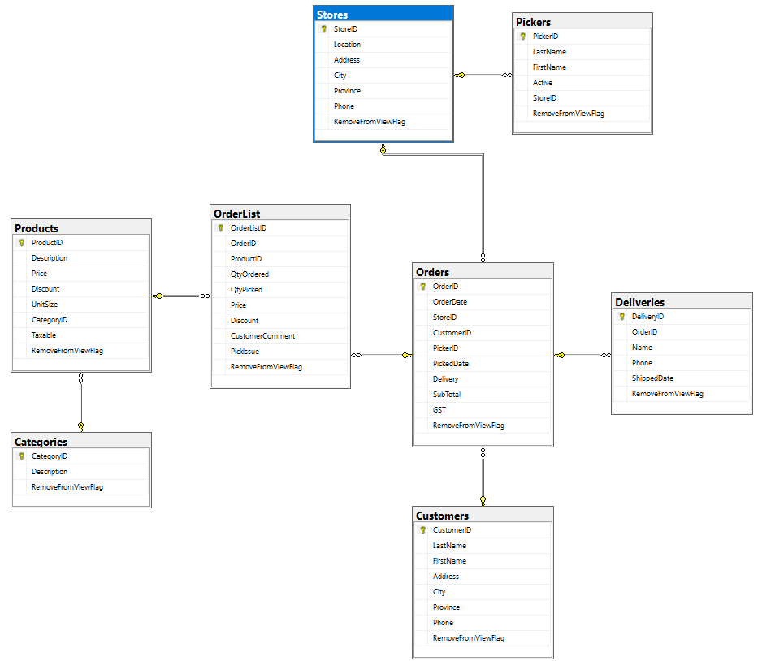
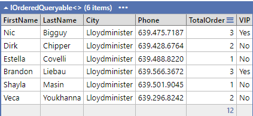
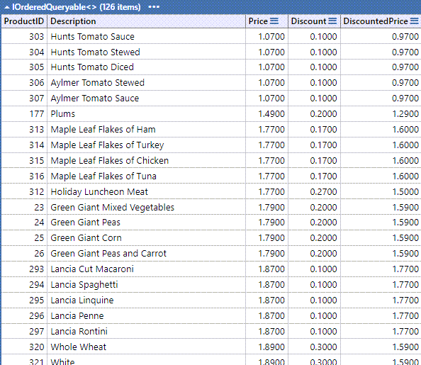
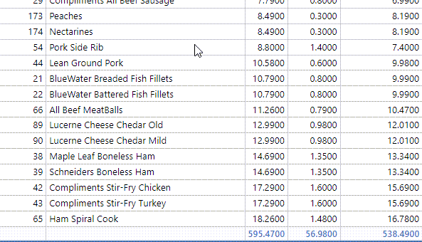
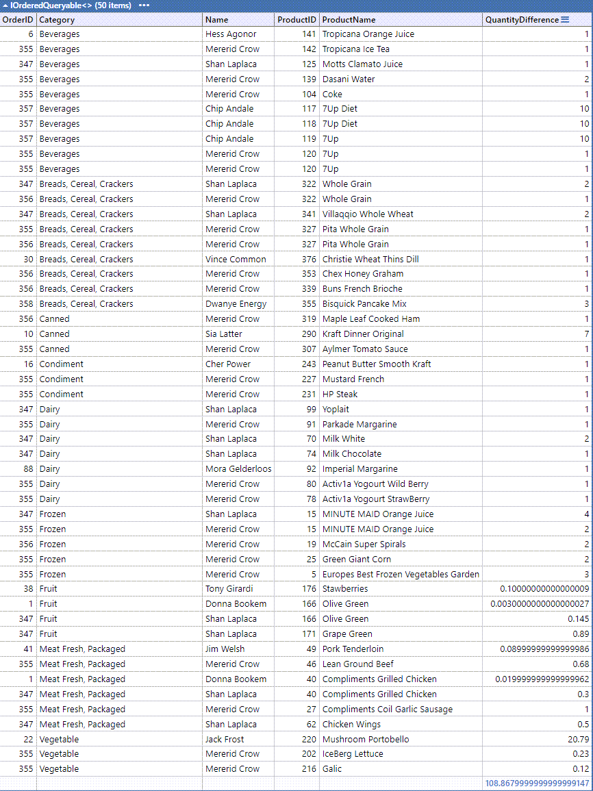
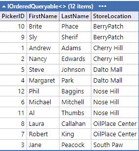
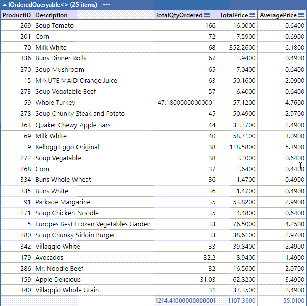

# In-Class Assessment #1 - Simple LINQ
## Marking Rubric (2 Marks)

| Weight | Breakdown                                                                                  |
|--------|--------------------------------------------------------------------------------------------|
| 2      | Proficient (requirement is met)                                                            |
| 1      | Limited (requirement is satisfactorily met, several errors)                                |
| 0      | Incomplete (requirement poorly/not met, major errors, missing large portions)              |

## Ten marks total with a possibility of two mark penalties (Insufficient commits)

## All queries must use the LINQ Method Syntax, not **Query Syntax.**

- **DO NOT USE ANY OF THE FOLLOWING**
  - **AI REFERENCE (ChatGPT, Meta.AI, etc).**
- **Doing so may subject you to academic discipline.**

### Overview

This exercise is based on the [Grocery List 2024](..\GroceryList-2024.bacpac). For this exercise, provide your answers as a LinqPad (.linq) document. Use a single LinqPad document containing all questions (you must use Statements as the LinqPad environment). You must commit to your [repository](https://classroom.github.com/a/3sQeIYnB) after completing each question.

# Assessment Questions

## Question 1 (2 Marks)

**Story:** The customer relationship team wants to identify and track the purchasing behavior of customers in Saskatchewan ("SK"). They are especially interested in finding out which customers can be classified as VIPs, based on the number of orders they have placed. A customer is considered a VIP if they have placed 3 or more orders.

**Requirements:** Generate a report that includes the first name, last name, city, phone number, the total number of orders, and a VIP status ("Yes" for customers with 3 or more orders, "No" otherwise). The report should only include customers from Saskatchewan who have not been flagged for removal. The results should be ordered by last name in ascending order and then by first name.

---

## Question 2 (2 Marks)

**Story:** The finance team is preparing a report on non-taxable products that are currently discounted. This report will be used to identify products that could be featured in an upcoming tax-free promotional sale.

**Requirements:** Create a report that includes the product ID, description, original price, discount amount, and the final price after the discount is applied. Only include products that are non-taxable, have a discount greater than $0, and have not been flagged for removal. The report should be ordered by price in ascending order, then by discounted price in descending order, and finally by product ID.

---

## Question 3 (2 Marks)

**Story:** The inventory control team needs to review orders where there is a discrepancy between the quantity ordered and the quantity picked. This review will help identify and address issues in the order fulfillment process.

**Requirements:** Generate a report that includes the order ID, product category, customer name, product ID, product name, and the difference between the quantity ordered and quantity picked. Only include order items where the quantity picked is less than the quantity ordered and where the order item has not been flagged for removal. The report should be ordered by product category in ascending order and then by product name in descending order.

---

## Question 4 (2 Marks)

**Story:** The operations manager wants to assess the availability and distribution of active pickers across different store locations. This information will be used to optimize staffing levels and ensure efficient operations.

**Requirements:** Create a report that includes the picker ID, first name, last name, and store location for all active pickers who have not been flagged for removal. Ensure the list is ordered by store location in ascending order, then by last name, and finally by first name.

---

## Question 5 (2 Marks)

**Story:** The sales analytics team is evaluating the performance of products based on the total quantity ordered. They want to focus on high-demand products that have generated significant revenue.

**Requirements:** Generate a report that includes the product ID, description, total quantity ordered, total revenue (calculated as the sum of prices for all orders), and average price. Only include products where the total quantity ordered across all orders exceeds 30 and that have not been flagged for removal. The report should be ordered by total quantity ordered in descending order, and then by product ID.

